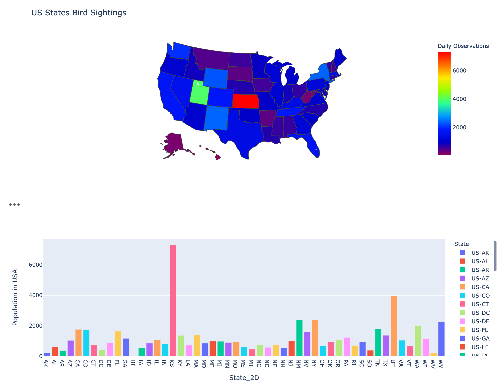
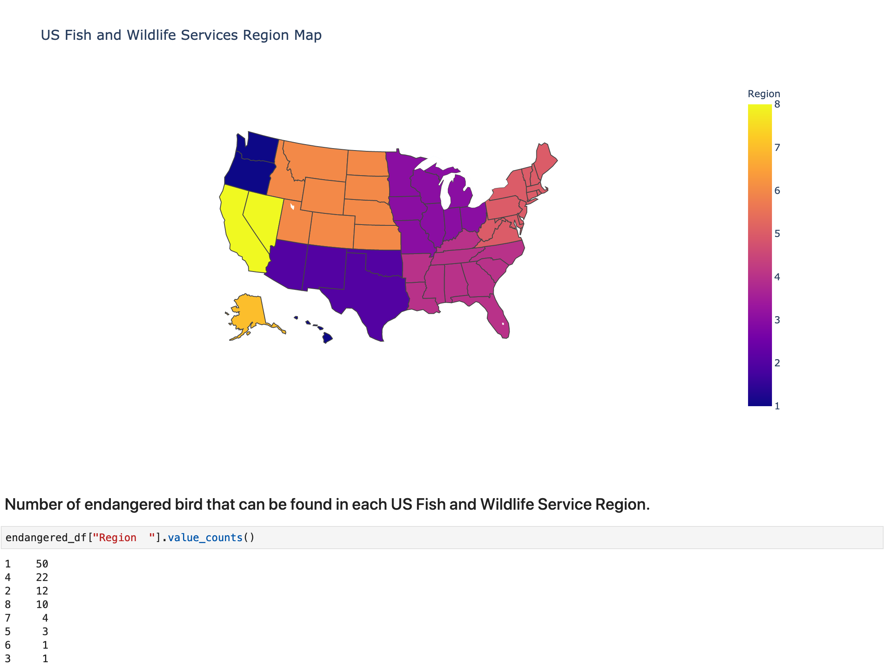
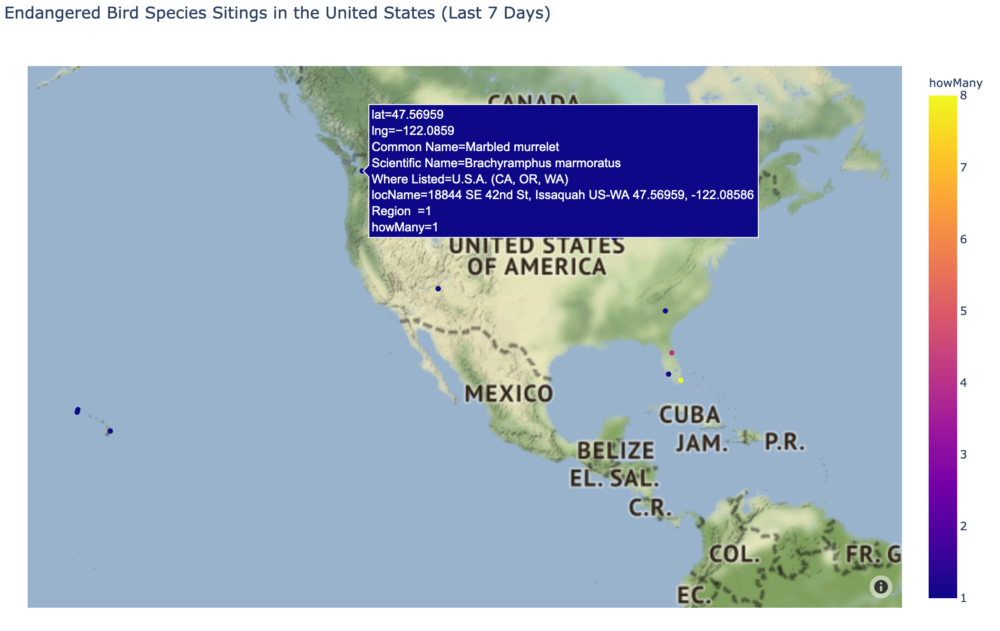

# eBirds_API

### For this exercise, we made serveral api requests from Cornell University's Ebird API. In order to run these request you will need to obtain an eBird API Key.

### Technology Employed: 
* Jupyter Notebook imports: CSV, OS, Requests, JSON, Datetime
* Python: Pandas, Numpy
* Visualizations: Plot.ly, mapbox

### Contributors
Rachel Reynolds: Parakeet Story 
David Vance: Notable Observations 
Stephen Lyssy: Endangered Birds 
Brad Lampton: State by State Observations 
Maria Sierra-Cardoza: Migratory Pattern (Ruby-Throated Hummingbird) 

### Below is a list of API Request in order to get the data we needed for the visualizations shown below.
* Migratory Pattern (Ruby-throated Hummingbird): https://api.ebird.org/v2/data/obs/US-TX/historic/2019/{month}/{day}
* Notable Observations: https://api.ebird.org/v2/data/obs/
* Endangered Birds: https://api.ebird.org/v2/data/obs/{{regionCode}}/recent, https://api.ebird.org/v2/product/stats/{{regionCode}}/{{y}}/{{m}}/{{d}}
* ParaKeet Story: https://api.ebird.org/v2/data/obs/{{regionCode}}/historic/{{y}}/{{m}}/{{d}}

## Migratory Pattern (Ruby-Throated Hummingbird)

 
 

 
 
## State Bird Sightings

## Notable Observations

## Endangered Birds

 
 

 

 

 
 
## Parakeet Story

